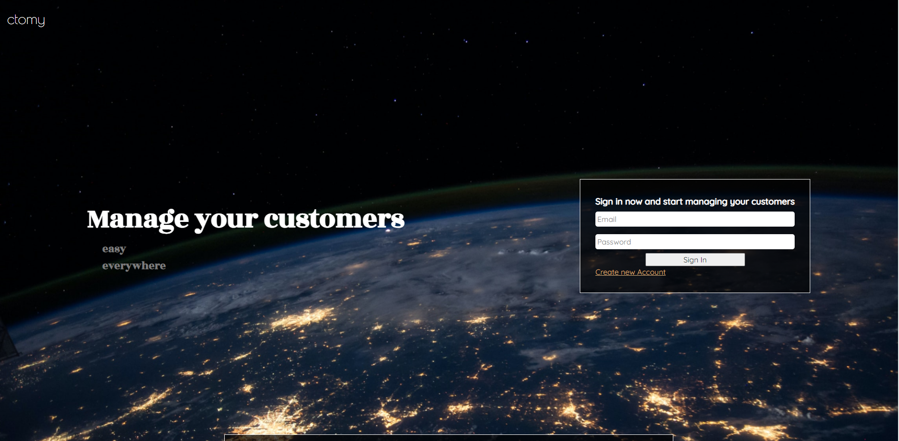
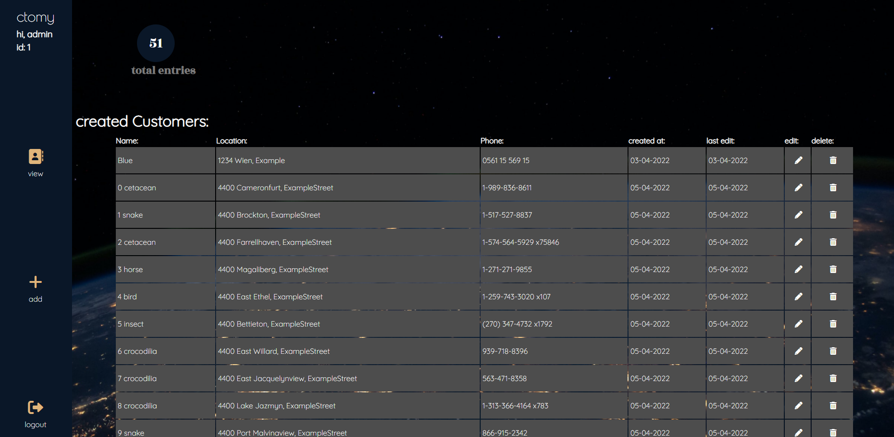
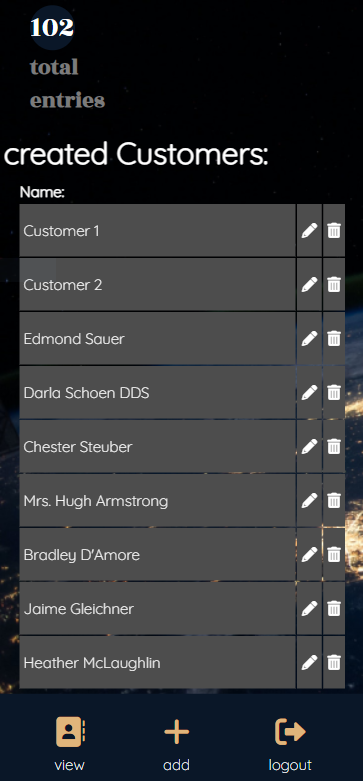

# Customer Manger Project for Codersbay
## ctomy
_Is a simple PHP CRUD Application, connected to a XAMPP Server and mysql Database_

* You can create a new Account and log in to it.
* After login in you can create, edit or delete the customers you have created.

__Build with:__

HTML, CSS3, PHP XAMPP, MariaDB

## Login Page

## Home Page

## Mobile
